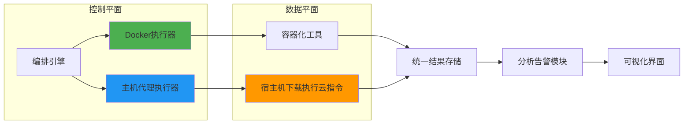
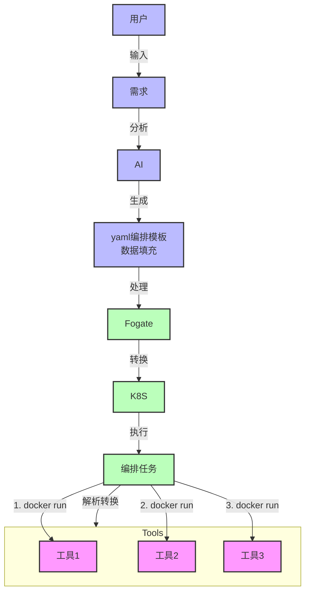
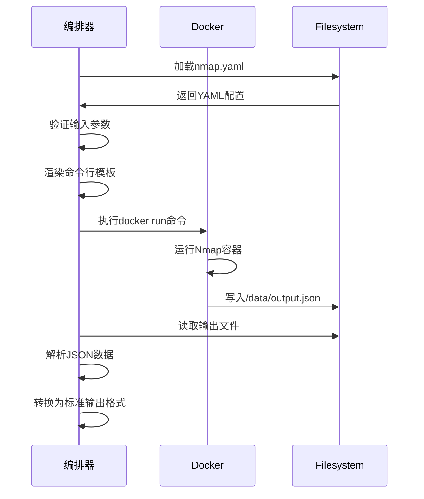

# Fogate - 安全自动化与编排平台

## 项目简介
Fogate是一个现代化的安全自动化与编排平台，致力于提供统一的安全工具管理、自动化编排和智能分析能力。通过标准化的接口和智能编排，提高安全运维效率，实现安全工作的自动化。

主要三个优势:
1. AI自动构建编排工具流程，自动填充工具参数，自动执行工具
2. 反向构建靶标: 根据任务信息(编排后的模板)
3. 无需写代码便可扩展新工具(利用dockerfile和yaml文件)

>> fog是旗 

>> gate是网关

## 技术层面的可行性
### 关于工具容器化
目前猜测80%左右都能容器化，容器化是有多种好处：
1. 通过包装层实现输入输出规范化
2. 分层治理：建立不同安全级别执行环境
3. 利用k8s管控全部工具的状态、日志、资源分配等

部分无法容器化的工具情况:
1. 硬件交互: USB Fuzz测试工具；IoT固件逆向工具
2. 操作系统内核级别检测工具: chkrootkit/rkhunter等Rootkit扫描工具， 容器会受限
总结起来原因主要两点:
1. 需要植入到宿主机但受限于docker无法访问宿主机底层 rootkit
2. 许可证受限难以适配容器环境

这种需要植入到宿主机的工具需要以代理形式放入宿主机，然后由平台下发各种指令来处理需求
我觉得类似这个: ​Tenable.io

### 关于AI运用
核心两点: 自动化编排和任务反向构建靶标
这两点是本项目的核心。不过以当前AI的能力和我们对AI的掌控力是无法实现完全依赖于AI的

基于以下两点：
1. 利用AI的api回答是随机性的
2. AI的模型是难以调理的（至少目前还没学所以不确定）

那么我认为半自动是可行的，另外可以依靠绝对的标准化来让AI减少随机性

标准化:
输入输出标准化、统一化是必须的，这也是SOAR的核心思路。对于不同工具的输入输出进行标准化，这方面还是利用代码。比如所有工具容器化，输出输入利用yaml文件做模板，输入参数用脚本转化或者yaml模板做转化输出内容做泛化（利用yaml或复杂的用脚本）。

多个工具编排好后也是规定的yaml形式，这样让ai生成编排的形式是按照固定的方式，减少随机性。每个工具的描述信息也在yaml中便于让ai分析。当生成好后的编排yaml文件，再利用ai对用户输入分析，将内容填充到编排模板中，用代码生成docker run命令，开始一个个执行。

半自动：
在编排任务完成后，可以让人工进行微调修改；在任务运行时可以输出类似deepseek的思考过程（对于我们就是执行过程），当用户认为执行过程可以调整，随时可以进行手动的调整（粒度在一个执行单元，也就是工具的运行）

对于AI根据任务（也就是工具编排的yaml模板）构建一个完整的靶标（蜜罐），目前来看很难做好，依旧根据标准化，AI对话前提前设定好Prompt，比如发给他一个构建标准的模板结构和工具信息，让AI根据两者生成构建模板，我们用代码解析和构建靶标。

目前情况2025年4月（发展太快只能写下时间），能用代码掌控流程的绝不用AI的api来掌控，可以让AI生成代码，但不要让AI当代码。除非自己调理的模型或者未来AI接口更强。

### 系统流程
1. 任务流程

2. 工具执行

### 核心功能
1. 工作流解析引擎
   - YAML转DAG
   - 条件分支处理
   - 循环逻辑支持

2. 工具运行时管理
   - 动态镜像加载
   - 输入输出映射
   - 版本兼容性

3. 任务队列调度
   - 优先级管理
   - 资源配额
   - 失败重试

4. 数据桥接服务
   - 协议转换
   - 文件传输
   - 数据过滤

5. 工具Dockerfile和yaml

### 技术栈
- 工作流引擎：Temporal.io
- 容器编排：K8s + client-go
- 缓存/消息队列：Redis / Kafka
- 存储系统：MinIO
- 监控系统：Prometheus + Alertmanager
- 服务网格：Istio
- 数据库：PostgreSQL 15、MYSQL、
- 日志系统：EFK
- 前端VUE
