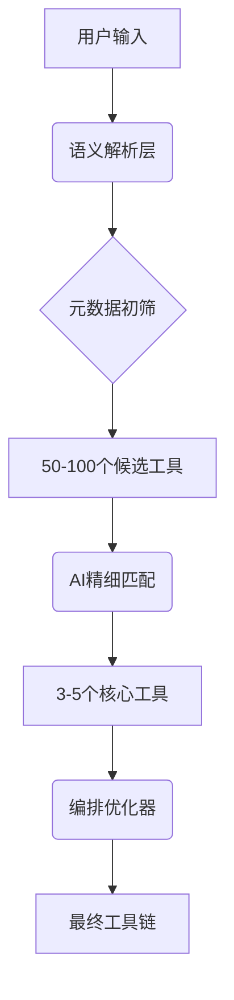

当下工作：
1. 接入尽可能多的开源工具
2. 建立符合上述开源工具的靶标
3. 提供api 描述所有工具基本信息
4. 提供api 获取指定工具描述详情（参数、使用方式等）
5. 提供api 获取一个任务下的一个执行单元的产出

核心难点：
接入一个工具应该尽可能的简单，从构建到部署到接入系统

这是重点中的重点，比整体的流程还要重要，因为他决定了所有工作
为什么？因为需要一个模板（能描述工具的各种信息）也能让ai识别他的使用方式，这个东西做好了
ai更容易理解不会犯大错，做好了更容易让系统扩展新工具

关于工具模板暂时使用tools/*.json 写了10个工具的例子。肯定不是最优解。
现在开始：
1. 用户输入需求
2. dify调用系统api返回所有工具的json基本介绍（工具名字、描述、能力、能力描述）
3. 根据需求+工具描述 = 编排结果（json）

AI问答描述核心
    基于 Dify + AI + 工程化项目 = **智能**安全验证平台
    流程
        1. 根据用户的输入信息，用语义分析出其中有用的资产比如ip，端口，操作系统等等
        2. 根据口述分析出的资产查询系统拥有的安全工具，筛选出合适的工具集
        3. 按照顺序进行编排（每个工具只完成自己能做的事情，比如nmap扫描出端口后，作为另一个工具的输入）
        4. 对每个工具的产出做泛化，结果有多种用途，如提供给用户分析查看，或者是下一个工具的输入
        5. 所有工具执行完成后根据产出结果，生成报告

    整体技术应该是围绕 dify + AI模型的api + 安全平台系统
    我现在的整个系统是没有接入AI的，用户要自己填写每个工具的执行参数，每个工具执行顺序要用户自己编排。
    我本地有一个工具管理，现在我想加入AI实现一个比较自动化，智能的平台。让用户可以傻瓜式的操作（只需要输入目标信息，就能自动验证安全情况）

我认为接入一个工具应该尽可能的简单，从构建到部署到接入系统这是重点中的重点，比整体的流程还要重要，因为他决定了所有工作
因为需要一个模板（能描述工具的各种信息）也能让ai识别他的使用方式，这个东西做好了
ai更容易理解不会犯大错，做好了更容易让系统扩展新工具。

我的问题是如何让工具更容易的接入一个系统无论是利用ai还是代码还是ai+代码；告诉我设计思路 然后用sqlmap这种参数多用起来复杂的工具当例子

### 难点
1. 安全工具有开源，有商采，有自研，五花八门，我希望很容易扩展到本系统里，不写代码导入到平台就能使用
2. 工具之间的调度，a工具输出数据如何让b工具当输入
3. 一个工具如果产出了百万条数据，如何让ai分析
4. 每个工具的每个参数细节需要让ai理解，才能生成合适的执行命令

### 产品化
1. 工具都能提供docker形式进行编排管理
2. toC和toB形式
3. 可以用我们自己提供的工具，也可以提供api录入到我们的平台，我们的平台核心就是智能调度

### 咨询
1. 帮我确认整体流程是否可行
2. 对整个项目分模块
3. 对我的技术难点做出较为简单的解答（后续我会详细问）
4. 整个系统产品化还需要完成哪些东西

回答我这四个问题

“扫描网络” → 匹配 Nmap 的 port_scan。
“检测漏洞” → 匹配 OpenVAS 的 vuln_scan。
“尝试利用” → 匹配 Metasploit 的 exploit 和 Hydra 的 brute_force。
“生成报告” → 匹配 Report Generator 的 generate_report.