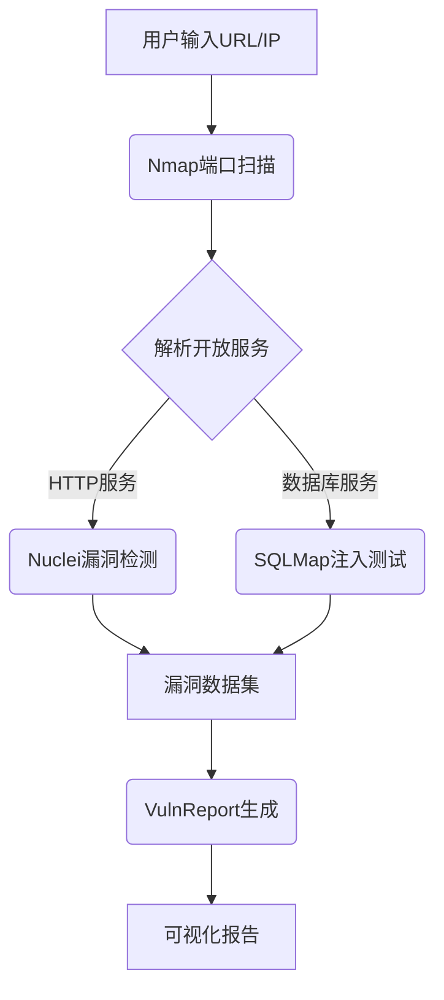
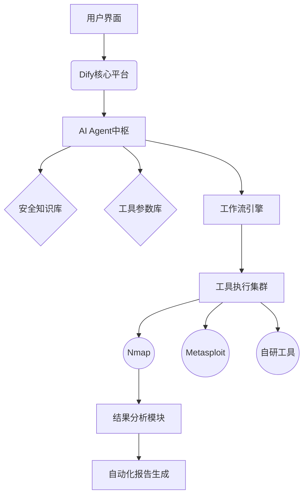
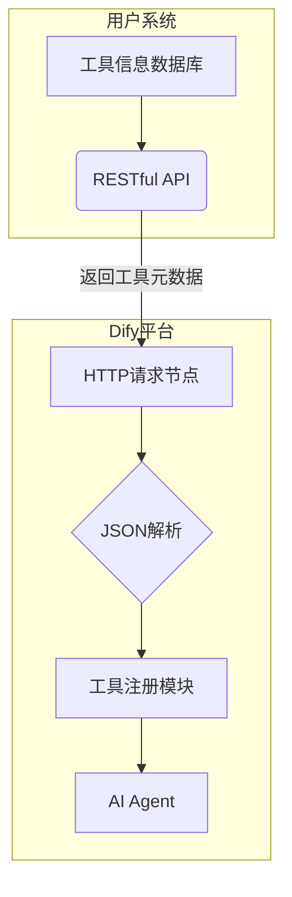

## 安全验证分析平台
基于 Dify + AI + 工程化项目 = **智能**安全验证平台
### 流程
1. 根据用户的输入信息，用语义分析出其中有用的资产比如ip，端口，操作系统等等
2. 根据口述分析出的资产查询系统拥有的安全工具，筛选出合适的工具集
3. 按照顺序进行编排（每个工具只完成自己能做的事情，比如nmap扫描出端口后，作为另一个工具的输入）
4. 对每个工具的产出做泛化，结果有多种用途，如提供给用户分析查看，或者是下一个工具的输入
5. 所有工具执行完成后根据产出结果，生成报告

整体技术应该是围绕 dify + AI模型的api + 安全平台系统
我现在的整个系统是没有接入AI的，用户要自己填写每个工具的执行参数，每个工具执行顺序要用户自己编排。
我本地有一个工具管理，现在我想加入AI实现一个比较自动化，智能的平台。让用户可以傻瓜式的操作（只需要输入目标信息，就能自动验证安全情况）

### 难点
1. 安全工具有开源，有商采，有自研，五花八门，我希望很容易扩展到本系统里，不写代码导入到平台就能使用
  1. 如何用yaml模板（其他也可以）描述一个工具
    描述一个工具要做以下工作：
      1. ai可以根据工具的描述判断是否要用这个工具
      2. 可以根据资产信息和工具参数描述道要如何配置参数
      3. 可以根据描述泛化出规范的（比如json）结果
      4. 有的工具结果是文本或者xml（比如appscan）这样还能利用yaml泛化吗
    以上靠一个yaml模板能完成和ai的互动吗；能的话给我提供一个如nmap的例子，不能的话告诉我怎么办,我希望在不写代码的情况下，靠ai和我的系统代码来轻松接入一个新的工具
2. 工具之间的调度，a工具输出数据如何让b工具当输入
3. 一个工具如果产出了百万条数据，如何让ai分析
4. 每个工具的每个参数细节需要让ai理解，才能生成合适的执行命令

### 产品化
1. 工具都能提供docker形式进行编排管理
2. toC和toB形式
3. 可以用我们自己提供的工具，也可以提供api录入到我们的平台，我们的平台核心就是智能调度


### 咨询
1. 帮我确认整体流程是否可行
2. 对整个项目分模块
3. 对我的技术难点做出较为简单的解答（后续我会详细问）
4. 整个系统产品化还需要完成哪些东西

回答我这四个问题

## 模块
用户输入处理模块

功能：接收用户输入（文本/文件），通过NLP提取资产（IP、域名等）。

技术：安全领域微调的LLM（如Security-BERT）+ 正则表达式兜底。

工具管理模块

功能：统一管理工具元数据（输入/输出格式、参数、执行方式）。

技术：标准化工具描述文件（YAML/JSON），支持Docker化工具自动注册。

工作流编排引擎

功能：根据工具依赖关系动态生成执行顺序（如nmap→漏洞扫描）。

技术：DAG调度框架（Apache Airflow）+ 规则引擎（Drools）。

结果泛化与分发模块

功能：解析工具输出为结构化数据，分发给用户或下游工具。

技术：适配器模式（Adapter Pattern）+ 消息队列（Kafka/RabbitMQ）。

AI集成模块

功能：提供语义分析、工具匹配、命令生成、报告总结。

技术：Dify（低代码AI编排） + LLM API（GPT-4/Claude3） + RAG（工具文档检索）。

报告生成模块

功能：聚合结果，生成多维度报告（漏洞列表、风险等级、修复建议）。

技术：模板引擎（Jinja2） + 自然语言生成（NLG）。

任务调度与资源管理模块

功能：管理工具执行的资源隔离、超时重试、优先级调度。

技术：Kubernetes + Celery。

API层

功能：对外提供标准化API，支持工具接入和第三方调用。

技术：RESTful API + OpenAPI 3.0规范

## 流程
1. 智能参数生成（AI Agent核心能力）
用户输入IP/端口/OS等信息后，通过Dify的​​Prompt编排模块​​生成结构化查询
示例Prompt："根据目标Windows Server 2019系统，生成nmap扫描参数组合，需包含漏洞检测和规避防火墙策略"

2. 利用RAG检索本地工具集

3. 自动编排工具集合
多个工具之间的执行顺序和执行结果，a工具的输入是b工具的输出

4. ​​智能分析结果
利用RAG管道关联漏洞库、修复方案等数据，输出报告



## 细节
### 语义分析+参数生成



​​语义理解与结构化建模​​
使用Dify的​​Prompt编排模块​​，将用户输入的IP、端口、操作系统等信息转化为结构化查询。例如：
"目标：Windows Server 2019，需扫描开放端口并检测CVE漏洞"  
→ 解析为：{"os": "windows", "task": "端口扫描+CVE检测"}  
结合知识库中的漏洞特征和工具能力矩阵，识别关键需求（如规避防火墙、深度服务识别）。
​​上下文增强​​
通过RAG（检索增强生成）从安全知识库中检索类似场景的历史参数配置，例如：
"同类系统常用nmap参数：-sV -T4 --script=vulners"

我们要做的是：
1. 构建好每个工具的信息（yaml模板）
2. 利用dify输入信息后，检索yaml输出工具集合编排

首先一个问题dify如何检索我本地的yaml？告诉我流程细节，我是否需要提供数据库和代码，利用rag让他调用？


1. nmap
```yaml
# nmap_scanner.yaml
identity:
  name: nmap_scanner
  label: 
    en_us: "Port Scanner"
    zh_hans: "端口扫描器"
  description:
    human: "网络探测与端口扫描工具"
    llm: "通过TCP SYN扫描检测目标主机的开放端口及服务版本信息，输出结构化的JSON数据"

parameters:
  - name: target_ip
    type: string
    required: true
    llm_description: "待扫描的IP地址或域名，例如：192.168.1.1"
  - name: scan_type
    type: select
    options: ["SYN","UDP","Comprehensive"]
    default: "SYN"
    llm_advice: "SYN扫描速度最快且不易被防火墙检测"

output:
  type: json
  schema:
    open_ports:
      type: array
      items: 
        type: object
        properties:
          port: {type: integer}
          protocol: {type: string}
          service: {type: string}
    os_info: {type: string}
  llm_mapping: "扫描结果可作为漏洞扫描工具的输入参数"  # 关键关联声明
```

2. nuclei
```yaml
# nuclei_scanner.yaml 
identity:
  name: nuclei_scanner
  label:
    en_us: "Vulnerability Scanner"
    zh_hans: "漏洞扫描器" 
  description:
    human: "基于开放端口的CVE漏洞检测工具"
    llm: "接收端口扫描结果，针对指定端口和服务类型执行CVE漏洞检测，支持5000+漏洞模板库"

parameters:
  - name: target_ports
    type: array
    required: true
    llm_description: "从端口扫描工具获取的开放端口列表，格式如：[{'port':80,'protocol':'tcp'},...]"
    source_variable: "nmap_scanner.output.open_ports"  # 声明参数来源
  - name: cve_template
    type: select
    options: ["critical","web_servers","database"]
    default: "critical"

output:
  type: json
  schema:
    vulnerabilities:
      type: array
      items:
        type: object
        properties:
          cve_id: {type: string}
          severity: {type: string}
          affected_port: {type: integer}
```


1. 多工具之间的交互
2. 工具产出非常庞大，一个ai的api调用无法执行。
3. 工具参数细节的理解，比如一个工具几十个参数，ai能不能根据用户输入，理解要用哪些参数，或者要根据系统资源改变哪些参数

工具集成很重要很复杂，需要让工具很简单导入系统。

需要摸清每个安全工具的使用场景参数各种细节

需要各种靶标来验证每次开发效果

需要构建完善的测试体系，因为里面一部分不是代码，而是提示词

能用代码的不用ai，代码更快更稳，ai的随机性是坑即便有提示词

需要深入学习dify的开发部署debug细节，今天遇到个调用本地工具失败，都无从下手

国际化问题：
我们非常依赖ai，我们的工具如果是很多国家提供的 yaml文件都不一样，我的建议是全部用英文；在输入的地方进行翻译；这样所有yaml都统一英文

开发
1. 一个任务周期 一次对话
2. 要分清api调用的几个方式 什么stream 啥的，融入到产品才好看
3. 构建工具知识库 让ai知道用哪个 怎么用
4. 我猜测工具产出还需要靠ai+代码组合，否则难以解决 超长文本 ai消化不了


对192.10.1.1做编排