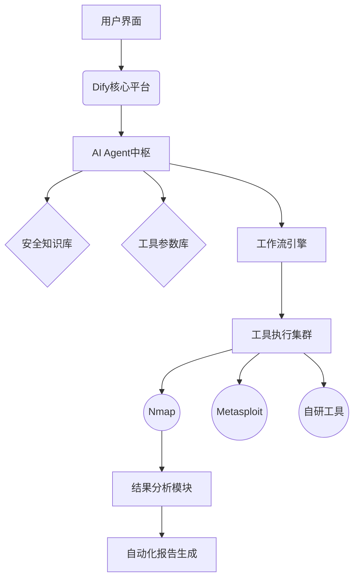
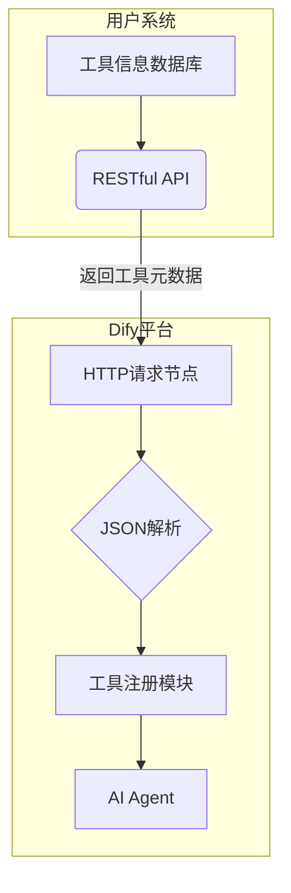

## 安全验证分析平台

1. 根据用户填写的信息 如：目标ip，目标端口 操作系统等等；
2. 根据用户信息选择合适的安全工具进行执行（如：nmap，msf，自研，开源等）
3. 选择多个工具后，进行编排（每个工具只完成自己能做的事情，比如nmap扫描出端口后，作为另一个工具的输入）
4. 整个工具集合执行完成，对目标安全情况做报告输出

我现在的整个系统是没有接入AI的，用户要自己填写每个工具的执行参数，每个工具执行顺序要用户自己编排。
我本地有一个工具管理，现在我想加入AI实现一个比较自动化，智能的平台。让用户可以傻瓜式的操作（只需要输入目标信息，就能自动验证安全情况）

基于 Dify+ AI Agent + 工程化项目 = **智能**安全验证分析平台

本系统的通用方案就是 **Dify+AI Agent** 可以适用大部分场景，验证平台只是一小部分而已

## 流程
1. 智能参数生成（AI Agent核心能力）
用户输入IP/端口/OS等信息后，通过Dify的​​Prompt编排模块​​生成结构化查询
示例Prompt："根据目标Windows Server 2019系统，生成nmap扫描参数组合，需包含漏洞检测和规避防火墙策略"

2. 利用RAG检索本地工具集

3. 自动编排工具集合
多个工具之间的执行顺序和执行结果，a工具的输入是b工具的输出

4. ​​智能分析结果
利用RAG管道关联漏洞库、修复方案等数据，输出报告



## 细节
### 语义分析+参数生成



​​语义理解与结构化建模​​
使用Dify的​​Prompt编排模块​​，将用户输入的IP、端口、操作系统等信息转化为结构化查询。例如：
"目标：Windows Server 2019，需扫描开放端口并检测CVE漏洞"  
→ 解析为：{"os": "windows", "task": "端口扫描+CVE检测"}  
结合知识库中的漏洞特征和工具能力矩阵，识别关键需求（如规避防火墙、深度服务识别）。
​​上下文增强​​
通过RAG（检索增强生成）从安全知识库中检索类似场景的历史参数配置，例如：
"同类系统常用nmap参数：-sV -T4 --script=vulners"

我们要做的是：
1. 构建好每个工具的信息（yaml模板）
2. 利用dify输入信息后，检索yaml输出工具集合编排

首先一个问题dify如何检索我本地的yaml？告诉我流程细节，我是否需要提供数据库和代码，利用rag让他调用？


1. nmap
```yaml
# nmap_scanner.yaml
identity:
  name: nmap_scanner
  label: 
    en_us: "Port Scanner"
    zh_hans: "端口扫描器"
  description:
    human: "网络探测与端口扫描工具"
    llm: "通过TCP SYN扫描检测目标主机的开放端口及服务版本信息，输出结构化的JSON数据"

parameters:
  - name: target_ip
    type: string
    required: true
    llm_description: "待扫描的IP地址或域名，例如：192.168.1.1"
  - name: scan_type
    type: select
    options: ["SYN","UDP","Comprehensive"]
    default: "SYN"
    llm_advice: "SYN扫描速度最快且不易被防火墙检测"

output:
  type: json
  schema:
    open_ports:
      type: array
      items: 
        type: object
        properties:
          port: {type: integer}
          protocol: {type: string}
          service: {type: string}
    os_info: {type: string}
  llm_mapping: "扫描结果可作为漏洞扫描工具的输入参数"  # 关键关联声明
```

2. nuclei
```yaml
# nuclei_scanner.yaml 
identity:
  name: nuclei_scanner
  label:
    en_us: "Vulnerability Scanner"
    zh_hans: "漏洞扫描器" 
  description:
    human: "基于开放端口的CVE漏洞检测工具"
    llm: "接收端口扫描结果，针对指定端口和服务类型执行CVE漏洞检测，支持5000+漏洞模板库"

parameters:
  - name: target_ports
    type: array
    required: true
    llm_description: "从端口扫描工具获取的开放端口列表，格式如：[{'port':80,'protocol':'tcp'},...]"
    source_variable: "nmap_scanner.output.open_ports"  # 声明参数来源
  - name: cve_template
    type: select
    options: ["critical","web_servers","database"]
    default: "critical"

output:
  type: json
  schema:
    vulnerabilities:
      type: array
      items:
        type: object
        properties:
          cve_id: {type: string}
          severity: {type: string}
          affected_port: {type: integer}
```

